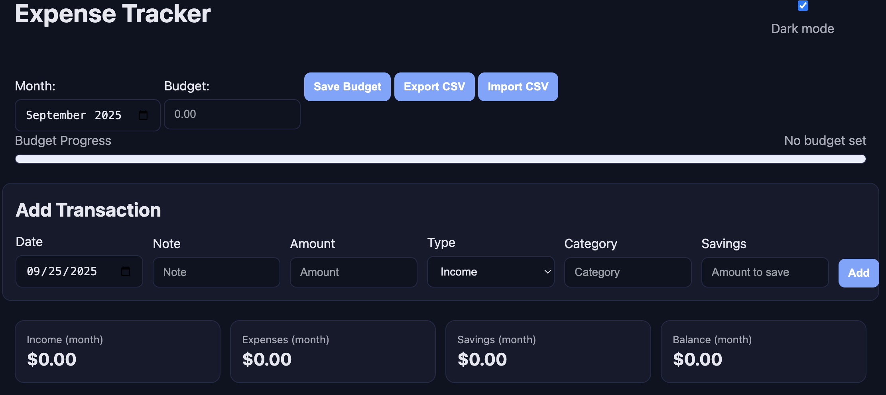

# Expense Tracker (Local) — Simple, Fast, Resume-Ready

A tiny, dependency-free web app to track income, expenses, and savings—all in your browser using localStorage. No backend required. Deploy as plain files or run locally with a one-liner server.

✨ Features

Add / edit / delete transactions

Income, Expense, Savings support (savings is a % or amount of an income entry you keep aside)

Monthly stats: Income, Expenses, Savings, Balance

Budget per month with progress bar + near/over-budget states

CSV import/export (round-trip safe)

Dark mode toggle (persisted)

Spending vs Savings chart (SVG, no libraries)

Works offline, no build step, no frameworks